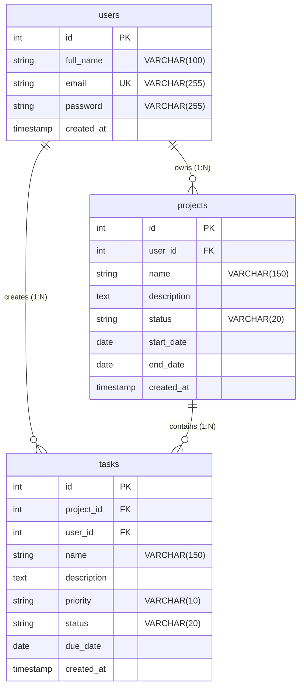

# TaskFlow Entity Relationship (ER) Diagram

The diagram below illustrates the relational schema, card capabilities, and foreign key relationships between `users`, `projects`, and `tasks`.

---

## Relationship Overview
- **User to Projects (1 : N)**: One user can own multiple projects (`projects.user_id -> users.id`).
- **Project to Tasks (1 : N)**: One project can contain multiple tasks (`tasks.project_id -> projects.id`).
- **User to Tasks (1 : N)**: Tasks belong directly to the authenticated user (`tasks.user_id -> users.id`).
